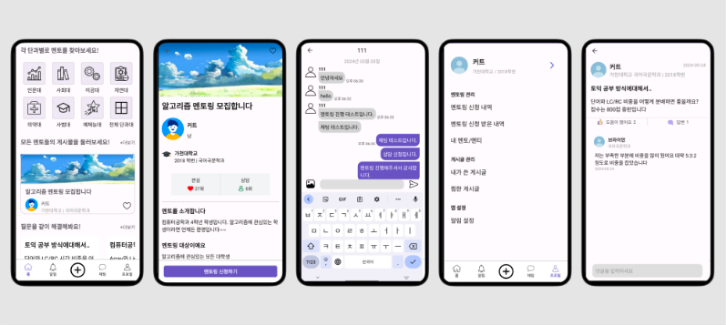

# 메멘토 

- 프로젝트 기간 : 24.01 ~ 24.06
- 프로젝트 인원 : 4명
---
## 프로젝트 기획의도
> 대학교에 다니면서 모르는 부분이나 궁금하거나 애매한 부분에 대해 물어볼 사람이 없는 경우가 많았다. 
> 이 때문에 '멘토가 있었으면 좋겠다'라는 생각을 자주 하게 되었다. 
> 현재 캠퍼스 내에서 소통하는 커뮤니티 앱은 존재하지만, 멘토를 구하는 것과는 거리가 있다고 생각한다. 
> 간편하고 빠르게 궁금한 점이 있으면 질문을 올려 도움을 받을 수 있는 전문적인 커뮤니티가 있다면 좋겠다는 생각이 들었고, 
> 선배나 졸업자가 자신이 알고 있는 지식을 후배들과 소통하는 커뮤니티가 있으면 좋겠다는 생각도 했다. 
> 또한, 자신이 다니는 학교에 국한되지 않고 같은 전공의 다른 학교와도 정보를 주고받을 수 있다면 성장 과정에 큰 도움이 될 것 같아 이 프로젝트를 기획하게 되었다.
---
## 프로젝트 기능
- 이용자는 모든 학교별 / 자신의 학교별에 따라 서비스를 이용할 수 있다.
- 이용자가 멘토가 되길 원할 경우 멘티 모집에 대한 과목, 조건등이 포함된 글을 작성한다. 
- 이용자가 멘티 모집 글에 신청 양식을 작성하고, 멘토는 신청 요청이 온 글을 보고 매칭여부를 결정한다.
- 매칭이 성사될 경우 실시간 채팅을 통해 멘토와 멘티간의 실시간 상담이 이어진다.
- 이용자는 질문 게시판을 통해 질문글을 올릴수 있으며 댓글을 통해 소통을 할 수 있다.

---
## ERD 

## Architecture

---
## 사용 기술
Back-End :   
- 
- 
- 
- 
- 
- 
- 
- 

Front-End 웹 :
- 
- 
- 
- 
- 

Front-End 모바일 :
- 
- 
- 

Tools :
- 
- 
- 

Collaboration : 
- 

etc: 
- 
- 
- 

---
## 웹 화면 순서도

---
## 모바일 화면 순서도

---
## 세부 기능

- 🔐 계정
  - 회원가입
  - 대학교 인증
  - 로그인/로그아웃
  - 카카오 or 네이버로 로그인 가능
  - 유효성/토큰

- 🏡 메인 게시판
  - 멘티 모집 글 양식에 맞게 작성 
  - 게시글 조회 후 신청
  - 즐겨찾기 
  - 게시판 필터별로 목록 조회 (검색, 즐겨찾기, 날짜, 카테고리, 학교별)
  - 무한 스크롤

- 👤 프로필
  - 프로필 사진 관리
  - 개인정보 관리/수정
  - 자신이 쓴 글 목록
  - 신청/매칭 목록
  - 알림 목록

- 💬 채팅방
  - 멘토, 멘티 매칭 시 실시간 채팅
  - 채팅방 목록
  - 읽음 처리
  - 텍스트 이외에 이미지, 파일 등 전송

- 🏡 질문 게시판
    - 질문 글 작성
    - 좋아요
    - 댓글
    - 게시판 필터별로 목록 조회
    - 무한 스크롤

- 🔔 알림
    - 채팅, 신청 등에 대한 알림

---
## 개발과정 
- 이용자가 로그아웃을 했지만 accessToken 은 만료되지 않아 탈취되었을 경우 위험에 대비하여 BlackList Entity 를 추가하여 로그아웃 시 해당 accessToken 을 db에
  저장하는 방식 채택

- 처음 알림 서비스기능을 구현할 때 SSE 를 통해 구현하려고 했다. SSE 는 별도의 프로토콜 없이 HTTP 만으로 구현이 가능하며 
네트워크 연결이 끊어지면 자동으로 재연결을 시도하며 실시간으로 서버에서 클라이언트로 데이터를 전송할 수 있지만 클라이언트에서 페이지를 닫을때(백그라운드 상태) 
서버에서 감지하기 어렵다는 점 때문에 FCM 방식을 채택

  
- Interceptor 사용 배경 과정 (WebSocket 의 STOMP 기능을 이용하여 실시간 채팅을 이용할 경우 메시지 전송할 때 header 부분에
  보내는 사람 정보와 채팅방 정보를 보내 Interceptor 를 통해 읽음 처리 기능 제공 (숫자 사라짐))

- 채팅방에서 파일 보낼때 직렬화해서 보냈는데 MultiPart 로 바꾼 과정

## 개선 사항
- 현재 redis 는 pub/sub 기능을 이용하여 실시간 채팅 용도로만 사용중이다.
이 프로젝트의 서비스들에 대한 정보는 메인 DB에 모두 저장하는 방식으로 진행하였는데 지금은 서비스 규모가 작기 때문에 별 다른 문제가
발생하고 있지 않고 있지만 채팅내역, FCM 토큰, RefreshToken 등의 정보는 redis 저장소를 이용하여 캐시 처리를 통해 메인 DB에 
부담을 줄여주는 방식에 대한 충분한 고려를 통해 서비스를 개발 요망

- 현재 aws ec2 에 spring boot 를 띄워 was 를 사용하고 있는데 보안적인 측면이나 성능 (로드 밸런싱등**)에 대한 보완을 위해
nginx 도입을 고려해야 할것 같다.

- Back-End 는 2명이서 협업을 통해 진행하였는데 aws 에 merge 하고 pull 하여 ec2 서버에 띄우는 일이 번거로우며 과금문제 또한
무시할수 없다. Docker 을 이용하여 docker container 통해 협업하는 사항에 대한 고려가 필요하다.
